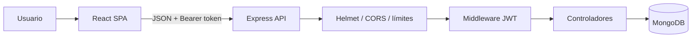

# 01. Arquitectura

## Vista general

| Capa | Repositorio | Responsabilidad |
| --- | --- | --- |
| Frontend | `password_manager` | SPA React, formularios y consumo de la API |
| Backend | `password_manager_back` | Autenticación, autorización y persistencia |

## Backend

- `config/env.js`: valida conexión, base por ambiente, correo, JWT y puerto;
  obtiene orígenes permitidos.
- `connection/config-mongo.js`: abre exclusivamente la conexión indicada por
  `BD_CNN`.
- `middlewares/validar-jws.js`: verifica firma, audiencia, emisor, expiración y
  versión de sesión.
- `middlewares/rate-limit.js`: limita registro, login y renovación.
- `middlewares/request-context.js`: asigna o propaga `X-Request-Id`.
- `middlewares/error-handler.js`: normaliza errores de aplicación, Express y
  Mongoose en un solo contrato.
- `middlewares/http-logger.js`: registra todas las solicitudes al finalizar,
  con estado, duración, usuario y código de error, sin secretos.
- `controllers/`: valida entradas y aplica autorización a nivel de documento.
- `models/`: define usuario y plataforma. Los campos sensibles están ocultos.
- `services/invitation.service.js`: genera tokens, hashes, expiraciones y URLs.
- `config/http-catalog.js`: única fuente de estados, códigos y mensajes HTTP.
- `helpers/http.js`: expone la API `RESP` para éxitos y errores semánticos.
- `helpers/async-handler.js`: envía rechazos asíncronos al middleware central.

El servidor espera la conexión MongoDB antes de escuchar y cierra servidor y
conexión ordenadamente ante `SIGINT` o `SIGTERM`.

## Modelos

### Usuario

| Campo | Detalle |
| --- | --- |
| `name` | 2 a 100 caracteres |
| `user` | Normalizado a minúsculas, índice único |
| `email` | Normalizado, único cuando existe |
| `password` | Hash bcrypt, costo 12, `select: false` |
| `tokenVersion` | Invalida JWT anteriores, `select: false` |
| `role`, `status` | Autorización y habilitación de la cuenta |
| `emailVerifiedAt`, `lastLoginAt` | Auditoría de correo y acceso |
| `img` | URL opcional, máximo 2048 caracteres |
| `fecha`, `actualizado` | Fechas de auditoría básica |

### Plataforma

| Campo | Detalle |
| --- | --- |
| `id_usuario` | ObjectId obligatorio e indexado |
| `name` | 1 a 100 caracteres |
| `url` | HTTP/HTTPS opcional |
| `fecha`, `actualizado` | Fechas |

Cada consulta, actualización y eliminación usa simultáneamente `_id` e
`id_usuario`; conocer el identificador de otro usuario no concede acceso.

### Invitación

Guarda correo, nombre, estado, expiración, creador y auditoría de consumo o
revocación. `tokenHash` y `activeEmail` están ocultos; el token original solo
existe durante el envío. Un índice único sobre `activeEmail` impide dos
invitaciones pendientes para el mismo correo.

## Sesión

1. Registro guarda un hash bcrypt; nunca guarda una contraseña recuperable.
2. Login compara con `bcrypt.compare`.
3. El JWT incluye `sub` y `ver`, con emisor y audiencia fijos.
4. El middleware vuelve a consultar la versión de sesión del usuario.
5. Cambiar contraseña incrementa `tokenVersion` e invalida todos los JWT
   anteriores.
6. Renovar sesión usa `POST` con contraseña en JSON, nunca en la URL.

## Frontend

`REACT_APP_API_URL` define la API. El cliente HTTP ofrece métodos `get`, `post`,
`patch` y `delete`; devuelve respuestas exitosas y lanza `ApiError` para HTTP,
contrato inválido o red. Así todos los módulos consumen `status`, `code`,
`message`, `details` y `requestId` de la misma forma.

Las rutas siguen una convención REST: recursos en plural, identificadores en el
path y filtros en query string. Al salir se eliminan únicamente `JWT`, `nombre`
y `user`.

El JWT aún se guarda en `localStorage`; migrarlo a una cookie `HttpOnly` requiere
rediseñar conjuntamente autenticación, CORS y protección CSRF.
