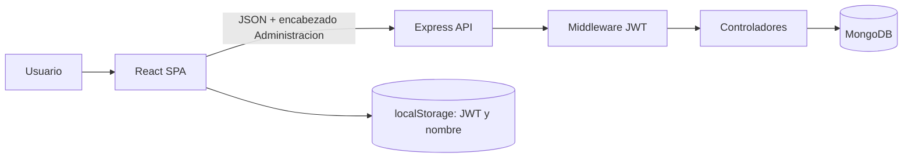

# Arquitectura

## Vista general

El producto está dividido en dos repositorios:

| Capa | Repositorio | Responsabilidad |
| --- | --- | --- |
| Frontend | `password_manager` | SPA React, navegación, formularios y consumo de la API |
| Backend | `password_manager_back` | API Express, autenticación y persistencia MongoDB |

## Backend

`index.js` carga variables de entorno, abre la conexión con MongoDB, registra
middlewares globales y monta tres routers:

- `/usuarios`: registro, autenticación y renovación de token.
- `/plataformas`: alta, lista, consulta, edición y eliminación.
- `/perfil`: consulta, edición y cambio de contraseña.

Las responsabilidades se distribuyen de la siguiente manera:

- `routes/`: vincula método y URL con cada controlador.
- `middlewares/validar-jws.js`: verifica el JWT y vuelve a consultar al usuario.
- `controllers/`: contiene lógica HTTP y consultas Mongoose.
- `models/`: define los documentos y el sobre común de respuesta.
- `helpers/`: genera tokens y cifra/descifra con AES.
- `connection/`: inicializa MongoDB. `config-db.js` y
  `usuarios.controller.js` pertenecen a una implementación MySQL anterior que
  ya no usan las rutas activas.

### Modelos actuales

**Usuario (`USUARIOS`)**

| Campo | Tipo | Detalle |
| --- | --- | --- |
| `name` | String | Obligatorio |
| `user` | String | Obligatorio; la unicidad se valida solo en el controlador |
| `password` | String | Obligatorio; actualmente cifrado de forma reversible |
| `img` | String | URL opcional |
| `fecha` | Date | Creación |
| `actualizado` | Date | Última actualización |

**Plataforma (`PLATAFORMAS`)**

| Campo | Tipo | Detalle |
| --- | --- | --- |
| `id_usuario` | String | Propietario |
| `name` | String | Obligatorio |
| `url` | String | Opcional |
| `fecha` | Date | Creación |
| `actualizado` | Date | Última actualización |

No existen todavía modelos de grupo ni de credencial/acceso.

## Frontend

La aplicación fue creada con Create React App y usa React Router, Material UI,
React Bootstrap, SweetAlert2 y `fetch`.

Áreas disponibles:

- `login` y `register`: acceso público.
- `plataformas`: lista, búsqueda, ordenamiento, alta, edición y eliminación.
- `perfil`: edición del nombre, usuario e imagen, y cambio de contraseña.
- `grupos`: interfaz creada, pero sin endpoints correspondientes en el backend.
- `includes`: menú, contador/renovación de sesión y componentes reutilizables.
- `context/backend.js`: URL base y tres wrappers de peticiones.
- `context/storaje.js`: JWT y nombre del usuario en `localStorage`.

El dashboard contiene texto provisional (`asdasd`) y la opción “Accesos” apunta
a una ruta no implementada.

## Flujos principales

### Inicio de sesión

1. React envía `user` y `password` a `POST /usuarios/auth`.
2. La API busca al usuario y descifra la contraseña guardada para compararla.
3. La API emite un JWT de 6 horas.
4. El frontend guarda el JWT y el nombre en `localStorage`.
5. Las siguientes peticiones envían el token en `Administracion`.

### Operación privada

1. `validarJWT` verifica firma y expiración.
2. Extrae `id`, `user` y `pass` del token.
3. Consulta nuevamente el usuario y compara esos datos con MongoDB.
4. Expone `req.uid` al controlador.

### Plataformas

La lista sí filtra por `id_usuario`. Las operaciones por identificador
(`consultar`, `actualizar` y `eliminar`) buscan únicamente por `_id`; actualmente
no comprueban que el documento pertenezca a `req.uid`.

## Configuración e integración

El backend utiliza `PORT` o `3000` por defecto. El frontend tiene
`http://localhost:3024/` escrito directamente en
`src/context/backend.js`. Para el estado actual, debe iniciarse el backend con
`PORT=3024`.

En producción también se debe configurar el servidor de la SPA para devolver
`index.html` en rutas de React Router. El `server.js` actual responde 404 cuando
una ruta como `/perfil` no corresponde a un archivo físico.

