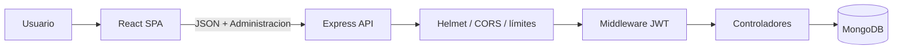

# Arquitectura

## Vista general

| Capa | Repositorio | Responsabilidad |
| --- | --- | --- |
| Frontend | `password_manager` | SPA React, formularios y consumo de la API |
| Backend | `password_manager_back` | Autenticación, autorización y persistencia |

## Backend

- `config/env.js`: valida `BD_CNN`, `SEED_TOKEN` y el puerto; obtiene orígenes
  permitidos.
- `connection/config-mongo.js`: abre exclusivamente la conexión indicada por
  `BD_CNN`.
- `middlewares/validar-jws.js`: verifica firma, audiencia, emisor, expiración y
  versión de sesión.
- `middlewares/rate-limit.js`: limita registro, login y renovación.
- `controllers/`: valida entradas y aplica autorización a nivel de documento.
- `models/`: define usuario y plataforma. Los campos sensibles están ocultos.

El servidor espera la conexión MongoDB antes de escuchar y cierra servidor y
conexión ordenadamente ante `SIGINT` o `SIGTERM`.

## Modelos

### Usuario

| Campo | Detalle |
| --- | --- |
| `name` | 2 a 100 caracteres |
| `user` | Normalizado a minúsculas, índice único |
| `password` | Hash bcrypt, costo 12, `select: false` |
| `tokenVersion` | Invalida JWT anteriores, `select: false` |
| `img` | URL opcional, máximo 2048 caracteres |
| `fecha`, `actualizado` | Fechas de auditoría básica |

### Plataforma

| Campo | Detalle |
| --- | --- |
| `id_usuario` | ObjectId obligatorio e indexado |
| `name` | 1 a 100 caracteres |
| `url` | HTTP/HTTPS opcional |
| `fecha`, `actualizado` | Fechas |

Cada consulta, actualización y eliminación usa simultáneamente `_id` e
`id_usuario`; conocer el identificador de otro usuario no concede acceso.

## Sesión

1. Registro guarda un hash bcrypt; nunca guarda una contraseña recuperable.
2. Login compara con `bcrypt.compare`.
3. El JWT incluye `sub` y `ver`, con emisor y audiencia fijos.
4. El middleware vuelve a consultar la versión de sesión del usuario.
5. Cambiar contraseña incrementa `tokenVersion` e invalida todos los JWT
   anteriores.
6. Renovar sesión usa `POST` con contraseña en JSON, nunca en la URL.

## Frontend

`REACT_APP_API_URL` define la API. El cliente HTTP está centralizado, acepta
respuestas 2xx, envía solo `Content-Type` y `Administracion`, y conserva los
mensajes JSON del backend. Al salir elimina únicamente `JWT`, `nombre` y `user`.

El JWT aún se guarda en `localStorage`; migrarlo a una cookie `HttpOnly` requiere
rediseñar conjuntamente autenticación, CORS y protección CSRF.

